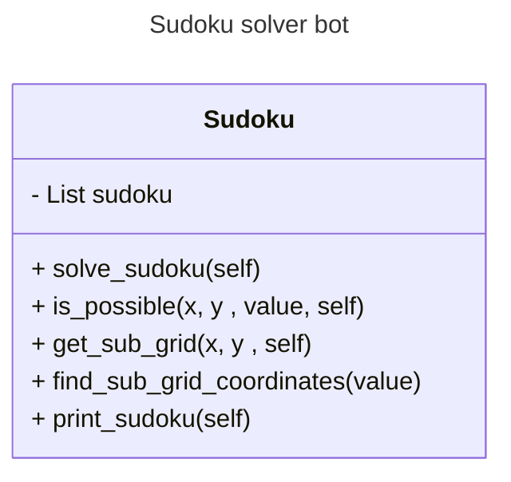

# Class diagram

```mermaid
---
title: Sudoku solver bot
---
classDiagram
  class Sudoku {
  - List sudoku
  + solve_sudoku(self)
  + is_possible(x, y , value, self)
  + get_sub_grid(x, y , self)
  + find_sub_grid_coordinates(value)
  + print_sudoku(self)

}
```
