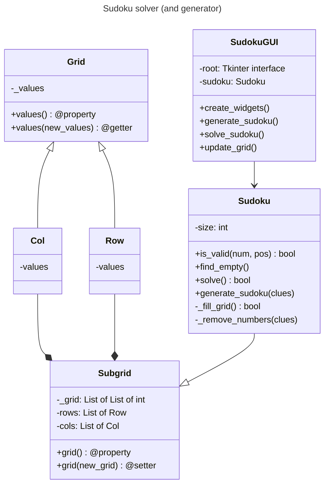

# Sudoku solver bot

## Description
This is a project to automatically solve an specific puzzle (a sudoku) and then upload it automatically to the web it came from. This would allow us to become absolute champions in the sudoku world without actually being so.

To integrate object-oriented programming, we designed the following class diagram.

## Class diagram

## Main classes:

"SudokuGUI" is a graphical user interface for generating and solving Sudoku puzzles.

    -Attributes:
        root (tk.Tk): The root window of the Tkinter application.
        sudoku (Sudoku): An instance of the Sudoku class that handles the puzzle logic.
        entries (list): A 2D list of Tkinter Entry widgets representing the Sudoku grid.
    -Methods:
        __init__(root, sudoku):
            Initializes the SudokuGUI with the given root window and Sudoku instance.
        create_widgets():
            Creates the widgets for the Sudoku GUI, including the grid of entries and buttons.
        generate_sudoku():
            Generates a new Sudoku puzzle with a specified number of clues and updates the grid.
        solve_sudoku():
            Solves the current Sudoku puzzle and updates the grid. Displays an error message if the puzzle cannot be solved.
        update_grid():
            Updates the GUI grid with the values from the Sudoku puzzle. Sets cells to read-only if they contain a value.

"Grid" is a class to represent a Sudoku grid.

    -Attributes:
        values (list): A list representing the values in the Sudoku grid.
    -Methods:
      __init__(values):
          Initializes the grid given a number of values.
      It also has a getter and a setter for its initializing values.

"Col" represents a column. Inherits from Grid.

"Row" represents a row. Inherits from Grid.

"Subgrid" is a class to represent a 3x3 subgrid in a Sudoku puzzle.
    
    -Attributes:
        _grid (list of list of int): The 3x3 grid representing the subgrid.
        rows (list of Row): List of Row objects representing each row in the subgrid.
        cols (list of Col): List of Col objects representing each column in the subgrid.
    -Methods:
        __init__(grid):
            Initializes the Subgrid with a 3x3 grid.
        grid:
            A getter for the current grid.
        grid(new_grid):
            A setter that updates the grid. Raises ValueError if the new grid is not 3x3.
"Sudoku": A class that represents a Sudoku puzzle.

    -Attributes:
        size (int): The size of the Sudoku grid (default is 9).
    -Methods:
        __init__(grid=None):
            Initializes the Sudoku grid. If a grid is provided, it validates the grid.
            Otherwise, it creates an empty 9x9 grid.
        is_valid(num, pos):
            Checks if a given number can be placed at a given position in the grid
            without violating Sudoku rules.
        find_empty():
            Finds an empty cell in the grid and returns its position as a tuple (row, col).
            Returns None if there are no empty cells.
        solve():
            Solves the Sudoku puzzle using backtracking. Returns True if the puzzle is solved,
            otherwise returns False.
        generate_sudoku(clues=30):
            Generates a Sudoku puzzle with a given number of clues. Fills the grid completely
            and then removes numbers to create the puzzle.
        _fill_grid():
            Fills the Sudoku grid completely using backtracking. This is a helper method
            used by generate_sudoku().
        _remove_numbers(clues):
            Removes numbers from the filled grid to leave only the given number of clues.
            Ensures that the resulting puzzle is still solvable.
          
