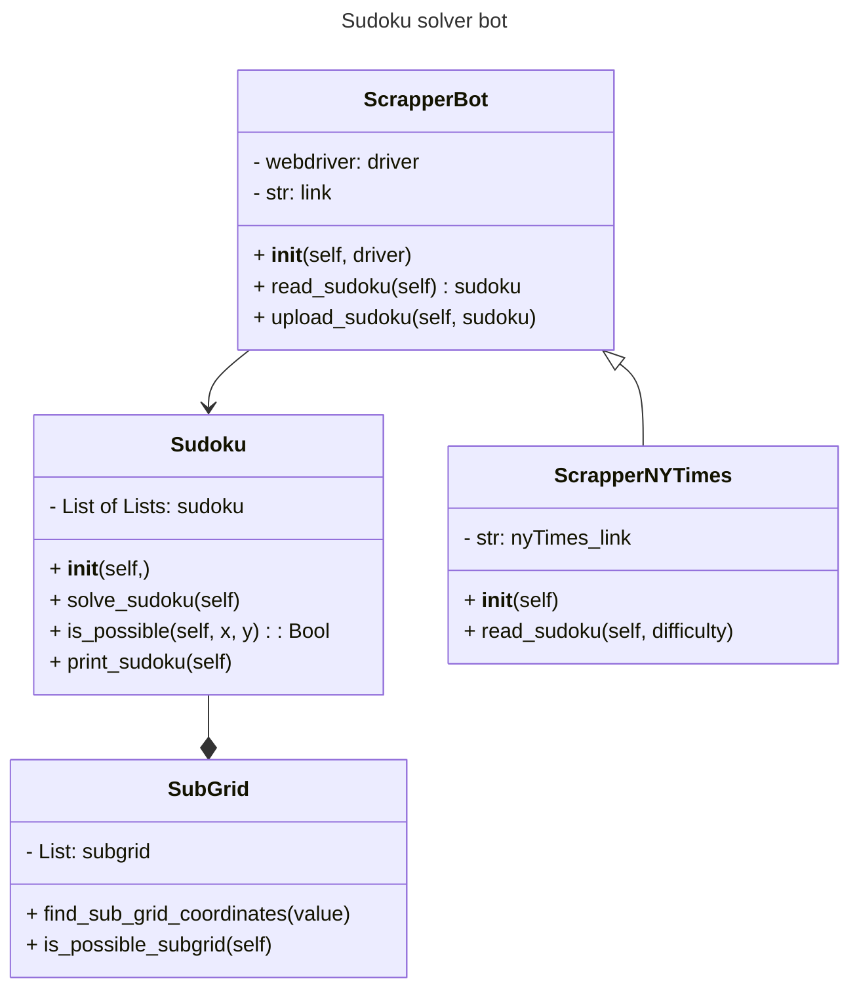

# Sudoku solver bot

## Description
This is a project to automatically solve an specific puzzle (a sudoku) and then upload it automatically to the web it came from. This would allow us to become absolute champions in the sudoku world without actually being so.

To integrate object-oriented programming, we designed the following class diagram.

## Class diagram

